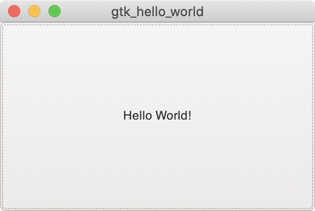

## GTK Hello World

Copy-pasted program from GTK docs <https://www.gtk.org/docs/language-bindings/rust/>

## Getting started

1. [Download Rust](https://www.rust-lang.org/tools/install)

    `curl --proto '=https' --tlsv1.2 -sSf https://sh.rustup.rs | sh`
1. `make run`
1. Enjoy your fully featured button app

    
